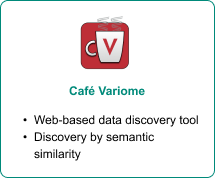
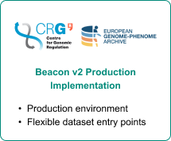
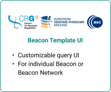
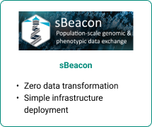

<h1 align="center">Deployment Guide</h1>

Implementing your own Beacon instance allows you to share genomic and phenotypic data securely, facilitating global data discovery and collaboration. Here's a streamlined guide to help you set up your Beacon:

<h3>1. Understand the Beacon Protocol</h3>

Familiarize yourself with the architecture of the Beacon specification, the structure of the Framework and the schema of the Data Model. 
> [Beacon Documentation](docs.genomebeacons.org)

<h3>2. Choose your implementation approach</h3>

There are several ways to implement a Beacon v2 instance, depending on your resources and expertise:

- **Full Implementation**: Develop your own REST API that adheres to the Beacon v2 specification, connecting it to your internal database: [Beacon v2 GitHub](https://github.com/ga4gh-beacon/beacon-v2/)

- **Utilize Existing Tools**: Leverage available software solutions and reference implementations provided by the Beacon community to simplify deployment.

  
      

  
      

<h3>3. Set up your internal database</h3>

Ensure your genomic and associated phenotypic data are stored in a structured format compatible with the Beacon v2 data model and define your filtering terms.  This organization is crucial for seamless querying and data retrieval.
> ***Note***: If using the CRG Beacon v2 Production Implementation (B2PI), this step is already handled. B2PI includes built-in support for data structuring, requiring only configuration of its components.

<h3>4. Set your security and privacy parameters</h3>

Implement authentication and authorization mechanisms to control data access, ensuring compliance with ethical standards and regulations. 
> ***Note***: Security and privacy mechanisms are integrated into the B2PI, reducing the setup effort to configuring the necessary components.

<h3>5. Test your Beacon instance</h3>

Before going live, rigorously test your Beacon instance:
<ul>
  <li><strong>Validation Tools</strong>: Use the Beacon Verifier to ensure your implementation meets the required specifications.</li>
  <li><strong>Community Feedback</strong>: Engage with the Beacon community for insights and potential collaboration opportunities.</li>
</ul>

> [Beacon Verifier](https://beacon-verifier-demo.ega-archive.org/)

<h3>6. Deploy and maintain</h3>

Once tested, deploy your Beacon instance and monitor its performance. Regular updates and maintenance are essential to align with evolving standards and to incorporate new features.

For comprehensive guidance and resources, visit the Beacon v2 Documentation and explore the GA4GH Beacon GitHub Repository.
> [Beacon Documentation](docs.genomebeacons.org) 
> [GA4GH Beacon GitHub Repository](https://github.com/ga4gh-beacon/ga4gh-beacon.github.io)

&nbsp;

<table>
  <tr>
    <td style="background-color:#f0f8ff; border-left:5px solid #4da3ff; padding:12px;">
      If you already have a Beacon instance, we kindly invite you to share it with us through <a href="https://docs.google.com/forms/d/e/1FAIpQLScORwEVRAlsa8qe9SerKZLGy6qjphApjsHXC8-EcaOrUpW8tw/viewform">this registration form</a>.
    </td>
  </tr>
</table>
