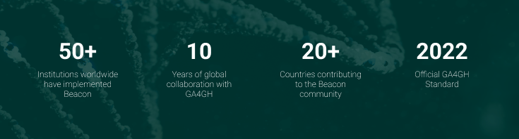

The GA4GH Beacon is an open, **global standard** for discovering biomedical data across diverse domains. It allows institutions to make their datasets findable and facilitates **federated data discovery** across a network of independently operated Beacon instances - each responding to standardized queries while retaining local control. Beacon’s **extensible data model** accommodates a wide range of data types, from genomic variants to clinical data and metadata. Researchers can either check for the presence of a genomic variant (Yes/No response) or gain more detailed information through **structured queries**. Beacon v2 supports **flexible access controls** to meet project needs and legal requirements, either by keeping access public or define who can see what, and under which conditions.

Beacon has been widely adopted, with ELIXIR Beacon Network being one of the [GA4GH Driver Projects](https://www.ga4gh.org/driver_project/elixir-beacon/). Similarly, Beacon is one of the critical components of another GA4GH Driver Project, the [Genomic Data Infrastructure](https://gdi.onemilliongenomes.eu/gdi-starter-kit.html), that is aiming to connect European countries and facilitate genomic data sharing and analysis. Numerous Beacon implementations exist worldwide.

## Beacon Project Timeline

## Beacon in Numbers

# The Beacon Features

Explore the feature that make data sharing with Beacon simple, flexible and scalable.

  

  

[Check all the features](#beacon-features_id)

## Announcements

