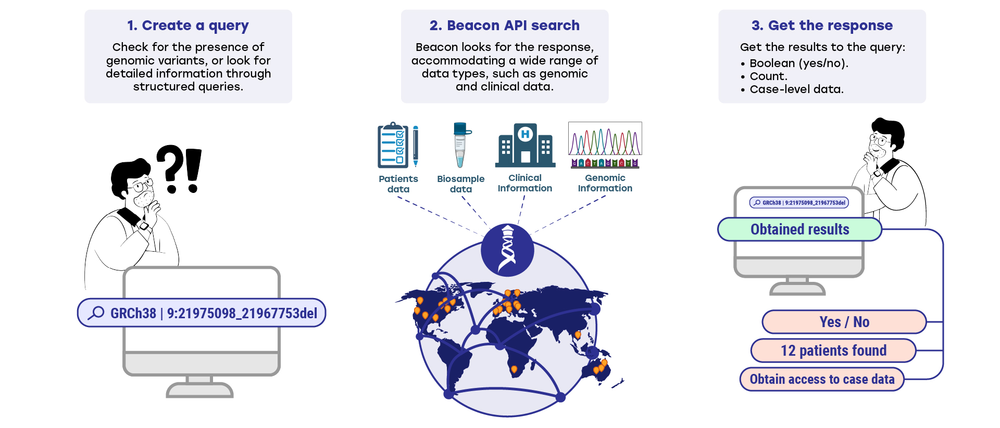
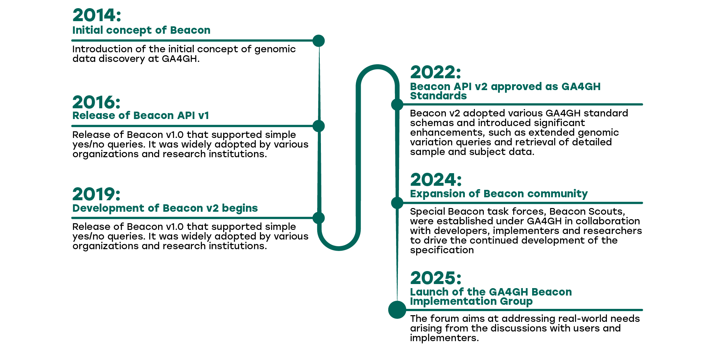
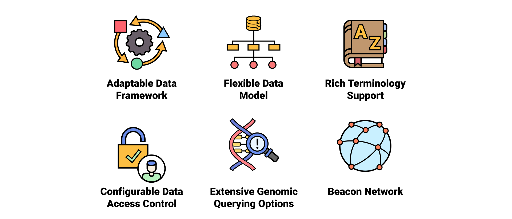
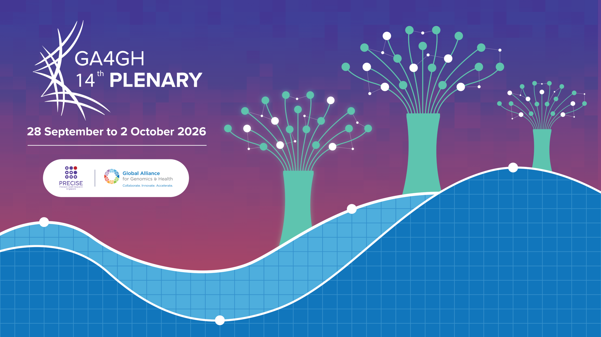

The GA4GH Beacon is an open, **global standard** for discovering biomedical data
across diverse domains. It allows institutions to make their datasets findable and
facilitates **federated data discovery** across a network of independently operated
Beacon instances - each responding to standardized queries while retaining local
control. Beacon’s **extensible data model** accommodates a wide range of data
types, from genomic variants to clinical data and metadata. Researchers can either
check for the presence of a genomic variant (Yes/No response) or gain more detailed
information through **structured queries**. Beacon v2 supports **flexible access
controls** to meet project needs and legal requirements, either by keeping access
public or define who can see what, and under which conditions.

  

Beacon has been widely adopted, with ELIXIR Beacon Network being one of the
[GA4GH Driver Projects](https://www.ga4gh.org/driver_project/elixir-beacon/). Similarly, Beacon is one of the critical components
of another GA4GH Driver Project, the [Genomic Data Infrastructure](https://gdi.onemilliongenomes.eu/gdi-starter-kit.html), that is
aiming to connect European countries and facilitate genomic data sharing and analysis.
Numerous Beacon implementations exist worldwide.

  

 

<h1 align="center">Beacon Project Timeline</h1> 

  

<h1 align="center">Beacon in Numbers</h1>

  

 

<h1 align="center">The Beacon Features</h1>

Explore the features that make data sharing with Beacon simple, flexible and scalable

 

<a href="/Beacon-Features">Check all the features</a>.
 

<h1 align="center">Announcements</h1>

     
    <strong>GA4GH Plenary Meeting 2026</strong>
    

      The GA4GH Plenary Meeting will take place in Singapore from September 28th to October 2nd. Please follow the GA4GH channels and website for more information.

    <a href="https://broadinstitute.swoogo.com/ga4gh-14th-plenary/11058020">Check it out</a>
  

<a href="/Announcements">Check all the announcements</a>.

